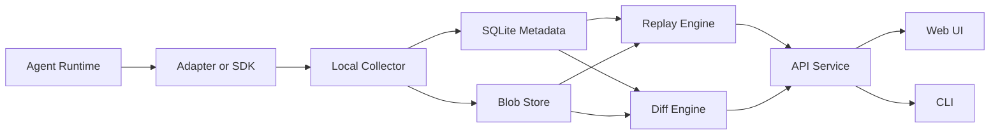

# ReplayKit Architecture

Status: design baseline

Audience: engineers building the collector, storage engine, replay engine, adapters, and UI

Primary goal: describe a decision-complete system for a local-first semantic replay debugger for agent runs

Related documents:

- [README.md](./README.md)
- [product.md](./product.md)
- [replay-semantics.md](./replay-semantics.md)
- [delivery-plan.md](./delivery-plan.md)

---

## 0. How to read this document

This document is intentionally deep.

It is meant to be the canonical technical reference for the first implementation.

It should answer:

- what ReplayKit is building
- why each subsystem exists
- how the subsystems fit together
- what contracts need to be defined
- what order work should happen in
- how correctness will be verified

This document is not optimized for brevity.

It is optimized for implementation safety.

If a future engineer needs to decide how a branch is persisted, how a span is invalidated, how a browser action is represented, or how a run diff is computed, this document should give enough guidance to proceed without inventing a new architecture.

The architecture is intentionally designed around a small number of strong principles:

- semantic replay instead of process replay
- local-first operation instead of hosted-first infrastructure
- branch and diff as first-class features instead of post-processing reports
- typed artifacts and snapshots instead of opaque blobs
- one canonical model shared by all adapters

The product will only be as coherent as the model underneath it.

That is why the architecture begins with semantics, not UI screens.

---

## 1. System purpose

ReplayKit exists to debug agent behavior.

It should make agent runs inspectable, replayable, branchable, and comparable.

An agent run in this context is a semantic execution graph of:

- planning steps
- model calls
- tool calls
- shell commands
- file reads and writes
- retrieval operations
- browser actions
- memory lookups
- human input
- guardrail checks

The system should not merely record that these things happened.

It should preserve enough structure that the user can:

- inspect each step as a semantic unit
- replay a run from recorded artifacts
- fork a run from any supported step
- patch inputs or outputs
- selectively recompute downstream work
- compare source and branch runs
- explain why one run succeeded and another failed

The core user loop is:

1. record a run
2. inspect the graph
3. identify the important step
4. branch from that step
5. patch one value
6. rerun the affected region
7. compare the outcome

If ReplayKit is good, users will stop thinking of runs as dead logs.

They will think of runs as editable execution histories.

That is the core design target.

---

## 2. Product boundaries

ReplayKit is not a workflow orchestrator.

It does not aim to schedule durable background jobs, own worker fleets, or guarantee long-running distributed execution.

ReplayKit is not a kernel-level recorder.

It does not aim to capture syscalls, threads, memory pages, or CPU-level nondeterminism.

ReplayKit is not a generic observability product.

It will include observability features because replay requires them, but tracing alone is not the product center.

ReplayKit is also not a general database for arbitrary event streams.

The system is optimized for one thing:

- semantic execution graphs of agents and adjacent automation systems

The initial design must support three classes of workloads:

- local coding agents
- generic SDK-integrated agents
- browser-heavy agents

The initial implementation priority is still local coding agents.

That is not a contradiction.

The architecture should generalize from the beginning, while the first production-quality adapter targets the narrowest and fastest path to a compelling debugger.

---

## 3. Differentiators

The architecture must serve the product differentiators directly.

Every subsystem should be justifiable in terms of one or more of these wedges.

### 3.1 Branching

Branching means:

- take an existing run
- choose a semantic step
- patch one thing
- create a new run with explicit lineage
- selectively recompute downstream work

Branching is not the same as retrying.

A retry is a new attempt of the same semantic step in the original execution.

A branch is a deliberate exploratory path with user-driven patches and preserved provenance.

The data model therefore needs explicit branch records.

The replay engine needs explicit patch manifests.

The UI needs to visualize source-to-branch lineage.

The diff engine needs to know which runs are comparable because one branched from another.

### 3.2 Diffing

Diffing means:

- compare two runs or two spans
- identify first divergence
- identify changed outputs
- identify changed statuses
- identify changed artifacts
- identify timing and cost deltas

Diff is not a convenience feature.

Diff is the answer to the user's most valuable question:

- what changed and why

That means diffs must be computed from semantic model data, not reconstructed ad hoc from raw logs.

### 3.3 Failure forensics

Failure forensics means:

- identify the deepest failing dependency
- distinguish causal failures from noise retries
- surface missing artifacts or unsupported replay blockers
- show the path from root to relevant failure
- support comparison against a successful branch or baseline

Failure analysis is only possible if the graph preserves data dependencies separately from control structure.

### 3.4 Local-first workflow

Local-first means:

- the normal workflow runs without a server deployment
- data is stored locally
- replay operates locally
- privacy defaults to local retention
- export is explicit

This changes architectural choices.

It favors:

- SQLite
- blob store on local disk
- local daemon
- web app or desktop shell talking to a local service

It disfavors:

- hosted control plane assumptions
- mandatory remote indexes
- per-user cloud identity in the critical path

### 3.5 Semantic replay

Semantic replay means:

- the unit of capture and replay is a domain operation
- the replay boundary is a completed span
- artifacts preserve meaningful inputs and outputs
- snapshots preserve meaningful state

The system should care about:

- prompts
- tool inputs and outputs
- file effects
- DOM snapshots
- retrieval sets
- human inputs

The system should not care about:

- raw thread scheduling
- instruction streams
- kernel event ordering

---

## 4. Design principles

The following principles should guide every implementation decision.

### 4.1 Canonical model first

Do not let the first adapter define the architecture implicitly.

Instead:

- define canonical types
- define canonical span kinds
- define canonical artifact types
- define canonical edge kinds
- make adapters translate into that model

This keeps the architecture stable as more runtimes are added.

### 4.2 Step-boundary replay

ReplayKit replays operations at semantic boundaries.

This keeps the system:

- portable across languages
- usable across frameworks
- conceptually aligned with agent developers

### 4.3 Explicit dependencies

Tree structure is not enough.

The graph must capture:

- control parentage
- data dependence
- retries
- replacements
- branch lineage

Without these edges:

- invalidation becomes too coarse
- diff explanations become too weak
- failure slicing becomes unreliable

### 4.4 Immutable source records

A completed run should be treated as immutable.

Branches create new runs.

Patches should never mutate source records in place.

This simplifies:

- integrity
- export and import
- comparison
- auditability

### 4.5 Artifacts out of line

Store large payloads as artifacts, not inline in primary span rows.

This improves:

- query performance
- storage deduplication
- schema evolution
- renderer specialization

### 4.6 API boundary over direct DB access

The UI and CLI should talk to a typed API layer.

They should not query SQLite directly.

This allows:

- schema evolution
- derived computations in one place
- access control later if needed
- easier testing

### 4.7 Safe degradation

When full replay information is unavailable, the system should degrade safely.

Examples:

- missing data dependencies should fall back to subtree invalidation
- missing rerunnable executors should block replay explicitly
- redacted artifacts should be marked as incomplete

Safe degradation is better than silent wrong answers.

### 4.8 Instrument the architecture for future growth

The first implementation is local-first, but the internal boundaries should not make future remote sync impossible.

Similarly:

- browser agents should fit without schema redesign
- non-Rust adapters should fit without storage redesign
- richer search should fit without refactoring every core type

---

## 5. System overview

At a high level, ReplayKit has six major layers:

1. adapters and SDKs
2. local collector daemon
3. storage engine
4. replay and diff engines
5. API service
6. UI and CLI

These layers map to different responsibilities.

### 5.1 Adapters and SDKs

Adapters run in or next to the user's agent runtime.

They observe semantic operations and emit structured records.

They should not implement business logic of storage, replay, or diff.

Their job is to:

- create spans
- attach events
- upload artifacts
- emit dependency edges
- emit snapshots
- provide enough metadata for replay

### 5.2 Collector daemon

The collector is the only write path into persistent storage.

It exists to:

- isolate instrumentation from storage details
- batch writes
- assign sequence numbers
- apply validation and redaction
- protect the main app from DB failures

### 5.3 Storage engine

The storage engine persists:

- run metadata
- spans
- events
- artifacts
- snapshots
- edges
- branch records
- replay job state
- diff summaries

### 5.4 Replay and diff engines

These are the core product engines.

They load run graphs, compute dirty regions, execute supported spans, and produce comparisons.

### 5.5 API service

The API service is the stable query and command surface used by both UI and CLI.

### 5.6 UI and CLI

The UI is the primary inspection and branch workflow.

The CLI is the first debugging surface and the fastest route to validating the model before the UI is complete.

### 5.7 Top-level data flow



---

## 6. End-to-end lifecycle of a run

This section describes how a single run moves through the system.

### 6.1 Run creation

An adapter decides a new logical run has begun.

It calls `begin_run` with:

- run name or entrypoint
- adapter metadata
- git SHA if available
- environment fingerprint
- root context metadata

The collector creates:

- a `run_id`
- a `trace_id`
- initial run metadata row
- initial sequence cursor

### 6.2 Span emission

As the runtime performs work, the adapter emits:

- `start_span`
- `add_event`
- `add_artifact`
- `add_snapshot`
- `add_edge`
- `end_span`

Spans should be emitted as soon as work begins.

Artifacts may be uploaded during or after execution, depending on size and adapter design.

### 6.3 Run completion

When the run finishes:

- the adapter calls `finish_run`
- the collector marks final status
- integrity checks confirm referenced artifacts exist
- derived summaries may be computed

### 6.4 Inspection

The UI or CLI loads the run through the API service.

The API assembles:

- summary
- tree
- timeline
- artifacts
- snapshots
- dependency graph
- failure summary

### 6.5 Recorded replay

The user may enter replay mode without modifying the run.

The replay engine reconstructs the run state sequence from stored data only.

### 6.6 Branch creation

The user selects a span and a patch.

The API creates a branch request.

The replay engine:

- loads the source graph
- applies the patch
- computes dirty spans
- creates a replay job
- executes supported dirty spans
- persists the new run

### 6.7 Diff

After branch completion:

- the diff engine computes summaries
- the UI shows first divergence
- span-level diffs become inspectable

### 6.8 Export

Any run or branch may be exported into a portable bundle.

### 6.9 Import

Imported runs remain immutable.

The user may branch from them locally, creating new local branch runs.

---

## 7. Agent classes and how they fit the same architecture

A major design requirement is that ReplayKit must support all target agent families without schema redesign.

This section explains how each class maps into the same core model.

### 7.1 Local coding agents

Typical operations:

- model call generates a plan
- tool calls inspect code
- shell commands build or test code
- file reads inspect sources
- file writes modify sources
- human input redirects the agent

Important artifacts:

- prompts
- model responses
- shell stdout and stderr
- file diffs
- patch summaries

Important replay requirements:

- prompt edits
- tool output overrides
- shell reruns when safe
- file system snapshot awareness

### 7.2 Generic SDK-integrated agents

Typical operations:

- planner steps
- model calls
- retrieval calls
- memory lookups
- custom tools
- message exchanges

Important artifacts:

- structured requests and responses
- retrieved document sets
- memory snapshots
- planner intermediate states

Important replay requirements:

- provider-agnostic adapters
- schema-stable transport
- rerunnable custom tools through explicit executors

### 7.3 Browser-heavy agents

Typical operations:

- navigation
- click
- type
- DOM query
- screenshot capture
- extraction
- model interpretation of page state

Important artifacts:

- URL and frame metadata
- DOM snapshot
- screenshot
- extracted structured data

Important replay requirements:

- semantic `browser_action` span kind
- metadata-rich artifacts
- graceful handling of operations that are inspectable but not rerunnable

### 7.4 Why the architecture can unify these

All three classes reduce to:

- semantic spans
- typed artifacts
- explicit snapshots
- explicit dependencies
- replay policy

The differences are primarily:

- artifact types
- adapter implementation
- executor support level

They are not reasons to fork the storage schema.

---

## 8. Domain model

This section defines the core entities.

### 8.1 Run

A run is the top-level record for one logical agent execution.

Required fields:

- `run_id`
- `trace_id`
- `source_run_id` for branches
- `entrypoint`
- `adapter_name`
- `adapter_version`
- `started_at`
- `ended_at`
- `status`
- `git_sha`
- `environment_fingerprint`
- `host_metadata`
- `title`
- `labels`

Derived fields:

- total span count
- total artifact count
- total error count
- total token count
- total cost estimate
- failure summary

### 8.2 Span

A span is the atomic semantic operation.

Required fields:

- `span_id`
- `run_id`
- `trace_id`
- `parent_span_id`
- `sequence_no`
- `kind`
- `name`
- `status`
- `started_at`
- `ended_at`
- `replay_policy`
- `executor_kind`
- `executor_version`
- `input_artifact_ids`
- `output_artifact_ids`
- `snapshot_id`
- `input_fingerprint`
- `environment_fingerprint`
- `attributes_json`

Optional fields:

- `error_code`
- `error_summary`
- `cost_metrics`
- `retry_group_id`
- `attempt_no`

### 8.3 Event

An event is a point-in-time record inside a span.

Use events for:

- progress markers
- low-volume structured logs
- validation notes
- execution checkpoints
- adapter diagnostics

Avoid using events as a replacement for artifacts.

Large or primary payloads should be artifacts.

### 8.4 Artifact

An artifact is a typed out-of-line payload.

Each artifact has:

- `artifact_id`
- `run_id`
- optional `span_id`
- `type`
- `mime`
- `sha256`
- `byte_len`
- `blob_path`
- `summary_json`
- `created_at`

Artifacts are content-addressed.

Multiple runs may reference the same blob content.

### 8.5 Snapshot

A snapshot is a typed view of relevant state at a moment in the run.

Snapshots are not full process memory.

They are curated semantic state.

Examples:

- conversation state
- scratchpad
- tool registry version
- file set fingerprint
- environment keys used
- browser tab metadata
- retrieved doc IDs

### 8.6 SpanEdge

A span edge connects two spans with explicit meaning.

Fields:

- `edge_id`
- `run_id`
- `from_span_id`
- `to_span_id`
- `kind`
- `attributes_json`

### 8.7 Branch

A branch is metadata describing how a new run was derived from a source run.

Fields:

- `branch_id`
- `source_run_id`
- `target_run_id`
- `fork_span_id`
- `patch_manifest_id`
- `created_at`
- `created_by`
- `status`

### 8.8 ReplayJob

A replay job tracks an in-progress recorded or forked replay execution.

Fields:

- `replay_job_id`
- `source_run_id`
- optional `target_run_id`
- `mode`
- `status`
- `created_at`
- `started_at`
- `ended_at`
- `progress_json`
- `error_summary`

### 8.9 RunDiff

A run diff is a derived comparison between two runs.

Fields:

- `diff_id`
- `source_run_id`
- `target_run_id`
- `first_divergent_span_id`
- `summary_json`
- `created_at`

---

## 9. Canonical enums and type contracts

The first implementation should freeze a stable set of enums.

This prevents adapter drift.

### 9.1 Span kinds

```text
Run
PlannerStep
LlmCall
ToolCall
ShellCommand
FileRead
FileWrite
BrowserAction
Retrieval
MemoryLookup
HumanInput
GuardrailCheck
Subgraph
AdapterInternal
```

### 9.2 Edge kinds

```text
ControlParent
DataDependsOn
RetryOf
Replaces
BranchOf
MaterializesSnapshot
ReadsArtifact
WritesArtifact
```

### 9.3 Replay policies

```text
RecordOnly
RerunnableSupported
CacheableIfFingerprintMatches
PureReusable
```

### 9.4 Run statuses

```text
Running
Completed
Failed
Interrupted
Canceled
Blocked
Imported
```

### 9.5 Span statuses

```text
Running
Completed
Failed
Skipped
Blocked
Canceled
```

### 9.6 Patch types

```text
PromptEdit
ToolOutputOverride
EnvVarOverride
ModelConfigEdit
RetrievalContextOverride
SnapshotOverride
```

### 9.7 Dirty reasons

```text
PatchedInput
FingerprintChanged
UpstreamOutputChanged
ExecutorVersionChanged
PolicyForcedRerun
MissingReusableArtifact
DependencyUnknown
```

### 9.8 Failure classes

```text
ModelFailure
ToolFailure
ShellFailure
FileSystemFailure
RetrievalFailure
BrowserFailure
GuardrailFailure
HumanDependency
ReplayUnsupported
IntegrityFailure
Unknown
```

---

## 10. Data model details

This section goes deeper on how each table or persisted record should behave.

### 10.1 `runs`

Purpose:

- list executions
- serve as the entry point into a run graph
- hold top-level metadata

Important columns:

- `run_id` primary key
- `trace_id`
- `source_run_id`
- `root_span_id`
- `branch_id`
- `entrypoint`
- `adapter_name`
- `adapter_version`
- `title`
- `status`
- `started_at`
- `ended_at`
- `git_sha`
- `environment_fingerprint`
- `host_json`
- `summary_json`

Notes:

- branch runs are just runs with lineage metadata
- imported runs should store import provenance
- `summary_json` may cache counts and final outcome summary

### 10.2 `spans`

Purpose:

- persist every semantic step

Important columns:

- `span_id`
- `run_id`
- `trace_id`
- `parent_span_id`
- `sequence_no`
- `kind`
- `name`
- `status`
- `started_at`
- `ended_at`
- `replay_policy`
- `executor_kind`
- `executor_version`
- `input_fingerprint`
- `environment_fingerprint`
- `snapshot_id`
- `attributes_json`
- `error_code`
- `error_summary`
- `cost_json`

Notes:

- do not inline large payloads here
- `sequence_no` must be monotonic within a run
- spans are immutable after completion except for derived caches if absolutely necessary

### 10.3 `events`

Purpose:

- capture low-volume structured time points

Important columns:

- `event_id`
- `run_id`
- `span_id`
- `sequence_no`
- `timestamp`
- `kind`
- `payload_json`

Notes:

- events should stay small
- if an event payload becomes large, upgrade it to an artifact and reference the artifact

### 10.4 `artifacts`

Purpose:

- store typed payload references

Important columns:

- `artifact_id`
- `run_id`
- `span_id`
- `type`
- `mime`
- `sha256`
- `byte_len`
- `blob_path`
- `summary_json`
- `redaction_json`
- `created_at`

Notes:

- `summary_json` should support cheap previews
- `redaction_json` should describe removed fields or transforms

### 10.5 `snapshots`

Purpose:

- store semantic state checkpoints

Important columns:

- `snapshot_id`
- `run_id`
- `span_id`
- `kind`
- `artifact_id`
- `summary_json`
- `created_at`

Notes:

- snapshot payload itself may live as an artifact
- `kind` distinguishes conversation, environment, file index, browser session metadata, etc.

### 10.6 `span_edges`

Purpose:

- persist typed relationships between spans

Important columns:

- `edge_id`
- `run_id`
- `from_span_id`
- `to_span_id`
- `kind`
- `attributes_json`

Notes:

- edge attributes may include field-level dependency info later
- there must be indexes on both `from_span_id` and `to_span_id`

### 10.7 `branches`

Purpose:

- keep branch lineage explicit and queryable

Important columns:

- `branch_id`
- `source_run_id`
- `target_run_id`
- `fork_span_id`
- `patch_manifest_artifact_id`
- `created_at`
- `created_by`
- `status`

### 10.8 `replay_jobs`

Purpose:

- track execution of replay or branch jobs

Important columns:

- `replay_job_id`
- `source_run_id`
- `target_run_id`
- `mode`
- `status`
- `progress_json`
- `created_at`
- `started_at`
- `ended_at`
- `error_summary`

### 10.9 `run_diffs`

Purpose:

- cache comparisons

Important columns:

- `diff_id`
- `source_run_id`
- `target_run_id`
- `first_divergent_span_id`
- `summary_json`
- `details_artifact_id`
- `created_at`

### 10.10 `search_documents`

Purpose:

- support full-text search without scanning every artifact blob

Important columns:

- `document_id`
- `run_id`
- optional `span_id`
- `source_type`
- `title`
- `body`
- `metadata_json`

### 10.11 `tags`

Purpose:

- label runs and branches for filtering

Important columns:

- `tag_id`
- `run_id`
- `key`
- `value`

---

## 11. Why SQLite plus blob store

The local-first architecture needs:

- simple deployment
- strong enough relational querying
- transactional writes
- straightforward backup and export

SQLite is the right default because:

- it is embedded
- it supports transactions
- it supports WAL mode
- it supports FTS
- it has low operational overhead

Blob store on disk is the right complement because:

- prompts and model outputs can be large
- shell logs can be large
- screenshots and DOM snapshots can be large
- file diffs can be large

Keeping these in files gives:

- content deduplication
- cheaper DB scans
- easier export assembly

### 11.1 Why not one big JSON document store

A single document store would make:

- graph traversal slower
- indexed filtering weaker
- integrity checks harder
- schema migration more dangerous

### 11.2 Why not a remote database first

A remote database would complicate:

- installation
- privacy defaults
- offline use
- portability

The architecture should allow remote sync later, but not require it.

### 11.3 WAL mode expectations

SQLite should run in WAL mode to improve concurrent read behavior.

The implementation should still serialize writes through the collector.

The collector should own DB connection policy.

The UI and CLI should not maintain their own write-capable DB sessions.

---

## 12. Repository layout and ownership

The repo should be organized by subsystem boundary, not by language alone.

A proposed layout:

```text
/README.md
/architecture.md
/product.md
/replay-semantics.md
/delivery-plan.md
/crates/core-model
/crates/storage
/crates/collector
/crates/replay-engine
/crates/diff-engine
/crates/api
/crates/sdk-rust-tracing
/crates/cli
/apps/web
/examples/coding-agent
/examples/generic-agent
/examples/browser-agent-stub
/fixtures/golden-runs
```

Ownership assumptions:

- `core-model` owns types and serialization contracts
- `storage` owns migrations and repositories
- `collector` owns ingestion validation and persistence orchestration
- `replay-engine` owns branch execution
- `diff-engine` owns comparison logic
- `api` owns query and command services
- `sdk-rust-tracing` owns Rust-side instrumentation helpers
- `web` owns the browser UI

No crate should define its own private version of canonical enums.

All such types should live in `core-model`.

---

## 13. Collector architecture

The collector is the heart of the write path.

It should be small, explicit, and robust.

### 13.1 Responsibilities

The collector should:

- accept structured writes from adapters
- validate contract conformance
- assign sequence numbers
- write metadata to SQLite
- write blobs to the artifact store
- enforce redaction rules
- recover unfinished runs
- expose internal diagnostics

The collector should not:

- render UI
- compute expensive diffs inline on every write
- embed adapter-specific logic
- become a generic plugin runtime

### 13.2 Why a collector exists at all

Without a collector:

- each SDK would need DB logic
- cross-language clients would diverge
- schema changes would spread everywhere
- crashes in app code could corrupt local writes more easily

The collector centralizes persistence concerns.

### 13.3 Ingestion protocol

The initial protocol can be:

- JSON over localhost HTTP
- or JSON over Unix domain sockets

Decision guidance:

- Unix sockets are cleaner for local-only performance and security on supported systems
- localhost HTTP is simpler for cross-language tooling and browser debugging

The implementation may ship HTTP first for simplicity.

The service should still be treated as local-only.

### 13.4 Request types

The collector must support these operations:

- `begin_run`
- `start_span`
- `add_event`
- `add_artifact`
- `add_snapshot`
- `add_edge`
- `end_span`
- `finish_run`
- `abort_run`
- `heartbeat_run`

### 13.5 Validation responsibilities

Validation should check:

- IDs are well-formed
- referenced runs exist
- referenced parent spans exist when expected
- artifacts referenced by spans exist
- enum values are valid
- timestamps are sane
- replay policy and executor fields are coherent

Validation should not become so strict that adapters cannot stream spans incrementally.

For example:

- a span may reference output artifacts uploaded moments later if the collector supports temporary pending state

The simpler initial rule is:

- upload artifacts before finalizing the span that references them

### 13.6 Sequence numbers

ReplayKit needs a deterministic UI scrubber order.

Wall clock timestamps are not enough.

The collector should assign a monotonic `sequence_no` within each run.

Every span and event should receive a sequence value or a range anchor.

Possible strategy:

- assign a sequence on each collector-side accepted operation
- store separate start and end sequence markers for spans if useful

### 13.7 Batching

Adapters should be able to batch writes.

Batching reduces overhead for:

- event-heavy runs
- artifact metadata writes
- high-frequency tool wrappers

The collector should process batches transactionally when possible.

### 13.8 Crash isolation

The collector should run independently from the instrumented app.

If the app crashes:

- the run is left `running`
- the collector may eventually mark it `interrupted`

If the collector crashes:

- the app should be able to reconnect
- partial writes should remain transactionally valid

### 13.9 Recovery scan

On startup, the collector should scan for:

- runs left in `running`
- spans left in `running`
- replay jobs left in `running`

It should mark them as:

- `interrupted`
- or resume if the replay engine explicitly supports resume later

### 13.10 Internal diagnostics

The collector should instrument itself with:

- ingest latency
- queue depth
- DB write latency
- blob write latency
- validation failures
- recovery actions

These diagnostics may be emitted through the same tracing stack, but they should be tagged as internal to avoid mixing with user runs by default.

---

## 14. SDK and adapter architecture

Adapters are how the system learns semantics.

The adapter contract must be rich enough to support replay.

### 14.1 Adapter responsibilities

An adapter must:

- decide when a run starts and ends
- decide what counts as a semantic span
- emit structured inputs and outputs as artifacts
- emit data dependencies where known
- emit snapshots at meaningful boundaries
- declare replay policy for each span

### 14.2 Adapter non-responsibilities

An adapter should not:

- compute diffs
- compute dirty subgraphs
- write directly to SQLite
- own branch execution logic

### 14.3 Rust adapter

The first adapter should integrate with Rust `tracing`.

Why:

- good span model
- async-aware
- natural fit for agent runtimes written in Rust
- strong path for shell and file instrumentation

The Rust adapter should include:

- a `tracing_subscriber::Layer`
- helper macros or functions for semantic span creation
- artifact upload helpers
- snapshot helpers
- dependency edge helpers

The adapter should support cases where:

- spans are created via macros
- artifacts are uploaded via explicit helper calls

This avoids stuffing large payloads into tracing fields.

### 14.4 Generic protocol adapter

Not every runtime will use Rust or `tracing`.

Therefore the canonical collector protocol must be public and versioned.

A future TS or Python SDK should:

- open a local session
- emit canonical records
- upload artifacts by hash
- receive validation errors consistently

### 14.5 Browser adapter

The browser adapter deserves special care.

It must emit semantic operations rather than only low-level browser logs.

A `browser_action` span should capture:

- action type
- selector or target
- URL before and after
- frame or tab metadata
- screenshot artifact if requested
- DOM snapshot artifact if requested
- extracted structured output

The architecture should allow browser actions to be:

- inspectable even when not rerunnable
- replayable later through a specialized executor

### 14.6 Tool wrappers

Tools are a major source of value and complexity.

Tool wrappers should standardize:

- tool name
- version
- structured input artifact
- structured output artifact
- stderr or failure artifact
- side effect declaration
- replay policy

### 14.7 File system wrappers

File reads and writes should be represented semantically.

For file read:

- path or logical file identifier
- version or content hash
- read mode
- returned content artifact or preview

For file write:

- path
- previous file hash if known
- new file hash
- patch artifact or file artifact
- side effect metadata

### 14.8 Shell command wrappers

Shell commands should include:

- command string
- working directory
- environment subset used
- exit code
- stdout artifact
- stderr artifact

Shell commands are important for coding agents and can be replayable if the environment is declared sufficiently.

### 14.9 Model call wrappers

Model calls should include:

- provider
- model
- request config
- prompt artifact
- response artifact
- token and cost metadata
- cache metadata if any

### 14.10 Retrieval wrappers

Retrieval spans should include:

- corpus identifier
- query artifact
- retrieved document set artifact
- ranking metadata
- index version

### 14.11 Human input wrappers

Human input is inspectable but not rerunnable in the same sense.

It should usually be:

- a `human_input` span
- `record_only`
- with message artifact and optional metadata

### 14.12 Adapter versioning

Adapters must report:

- adapter name
- adapter version
- supported schema version

This is necessary for:

- replay compatibility
- debugging capture differences
- future migrations

---

## 15. Artifact subsystem

Artifacts are central to replay.

The architecture must treat them as first-class typed records, not just file attachments.

### 15.1 Artifact goals

Artifacts should:

- preserve primary inputs and outputs
- support preview rendering in the UI
- support diffing
- support content deduplication
- survive export and import

### 15.2 Artifact identity

An artifact should have:

- logical identity in the DB by `artifact_id`
- content identity by `sha256`

This distinction matters.

Two artifact records may point to the same blob content but belong to different runs or spans.

### 15.3 Artifact storage layout

One practical layout:

```text
data/
  replaykit.db
  blobs/
    sha256/
      aa/
        bb/
          aabbcc...blob
```

This avoids large single-directory fanout.

### 15.4 Artifact summaries

The UI should not read full blobs for list views.

Each artifact row should store a lightweight summary, such as:

- text preview
- JSON top-level keys
- image dimensions
- file diff stats
- token count

### 15.5 Artifact manifest concept

Certain artifact types should carry structured manifest metadata.

For example:

- file diff manifest
- model request manifest
- tool output manifest
- DOM snapshot manifest

This metadata should live in `summary_json` or typed artifact-specific preview fields.

### 15.6 Artifact diff support

Artifact types should declare a preferred diff strategy:

- text diff
- JSON structural diff
- binary identity only
- image metadata diff
- file patch diff

The diff engine should dispatch by artifact type and MIME.

### 15.7 Artifact integrity

Every artifact read should verify:

- DB row exists
- blob file exists
- hash matches when integrity checks are enabled

Missing artifacts are a serious error because replay relies on them.

### 15.8 Artifact retention

The local product should default to retaining artifacts unless the user deletes runs.

Future retention policies may prune old runs, but v1 should optimize for reliability of debugging, not storage minimalism.

### 15.9 Artifact redaction

Artifacts may need field-level or full-value redaction before persistence.

Redaction metadata must be preserved so the UI can explain why replay may be limited.

---

## 16. Snapshot subsystem

Snapshots preserve semantic state.

They are not raw heap dumps.

### 16.1 Why snapshots matter

Without snapshots, replay and diff lose context about:

- conversation state
- working memory
- available tools
- environment inputs
- browser metadata
- retrieved context

### 16.2 Snapshot kinds

Recommended initial snapshot kinds:

- `conversation_state`
- `scratchpad_state`
- `environment_state`
- `tool_registry_state`
- `file_index_state`
- `browser_session_state`
- `retrieval_state`
- `model_config_state`

### 16.3 Snapshot granularity

Snapshots should be captured at meaningful checkpoints:

- start of run
- after planner step
- before or after major tool call
- before final answer
- at branch point if patching context

Too many snapshots waste space.

Too few snapshots weaken replay clarity.

The initial rule should be:

- snapshot at run start
- snapshot after any span that materially changes reusable state

### 16.4 Snapshot payload format

Snapshots should be stored as JSON artifacts when possible.

This enables:

- preview rendering
- field diffing
- easy export

### 16.5 Snapshot use in replay

Snapshots help:

- reconstruct UI state
- seed rerunnable executors
- compute environment compatibility
- diff state across branches

### 16.6 Snapshot use in failure forensics

Failure analysis should be able to say:

- environment differed here
- tool registry version changed here
- retrieved context changed here

Snapshots make those statements possible.

---

## 17. Dependency graph

The dependency graph is the difference between a trace viewer and a replay debugger.

### 17.1 Why the tree is insufficient

Suppose a planner creates a plan.

Then three tools run.

Then a final answer consumes only tool results 1 and 3.

The control tree alone cannot tell the system that tool result 2 did not matter.

Without explicit data edges:

- all downstream recomputation becomes too broad
- failure explanations become vague
- diffs cannot highlight causality cleanly

### 17.2 Required graph semantics

The graph must support:

- parent-child nesting
- data dependence
- retries
- replacements
- branch lineage

### 17.3 `ControlParent`

Use for:

- structural nesting
- timeline grouping
- tree rendering

### 17.4 `DataDependsOn`

Use for:

- any semantic use of output from one span by another

Examples:

- final answer depends on retrieval result
- tool call depends on planner output
- model call depends on memory lookup

### 17.5 `RetryOf`

Use for:

- second or later attempts of the same logical step

This enables retry collapsing.

### 17.6 `Replaces`

Use for:

- one span superseding another result in the same run or branch

This can help represent explicit substitutions or later branch evolution.

### 17.7 `BranchOf`

Use for:

- span-to-span lineage across runs if needed

The branch record already links runs.

Optional span-level branch lineage can improve detailed diff navigation.

### 17.8 Dependency emission strategy

Best case:

- adapters emit explicit data dependencies at capture time

Fallback:

- the replay engine infers some dependencies from known adapter conventions

Worst case:

- the engine conservatively dirties control descendants

### 17.9 Dependency validation

The collector should validate that:

- both endpoint spans exist
- edges do not create impossible self-cycles unless specifically allowed for retry metadata

### 17.10 Dependency visualization

The UI should show:

- parent tree by default
- selected dependency edges on demand
- first divergence path
- failed dependency path

---

## 18. Replay engine overview

The replay engine is the subsystem that turns capture into an interactive debugger.

### 18.1 Responsibilities

The replay engine should:

- load source runs
- validate replay completeness
- create replay jobs
- apply patches
- compute dirty sets
- reuse safe upstream results
- rerun supported dirty spans
- persist branch runs
- expose replay progress

### 18.2 Non-responsibilities

The replay engine should not:

- own raw storage writes directly without repository abstractions
- make UI decisions
- infer product-level meaning from textual logs when structured data exists

### 18.3 Replay modes

Supported modes:

- recorded replay
- forked replay

Potential future modes:

- live attached replay
- breakpoint step-through
- remote imported replay

### 18.4 Recorded replay flow

Recorded replay consists of:

- loading run summary
- loading span tree and timeline
- loading artifacts and snapshots as needed
- computing derived views

No user code or external tool should run.

### 18.5 Forked replay flow

Forked replay consists of:

- choose source run
- choose fork span
- create patch manifest
- validate patch type against span kind
- compute dirty set
- create target run
- materialize reused upstream spans
- rerun dirty spans in order
- persist outputs and new snapshots
- compute diff

### 18.6 Replay job states

Suggested states:

- `queued`
- `validating`
- `running`
- `blocked`
- `failed`
- `completed`
- `canceled`

### 18.7 Replay determinism stance

ReplayKit does not claim deterministic process replay.

It claims explicit replay behavior at step boundaries.

Therefore:

- some spans are reused
- some spans rerun
- some spans block replay

This is expected.

### 18.8 Replay engine invariants

The engine must never:

- silently skip a dirty span
- silently substitute missing artifacts
- mutate source run records
- continue past a blocked rerunnable boundary without marking the branch blocked

---

## 19. Replay patch model

Patches are how branches become intentional rather than accidental.

### 19.1 Patch manifest requirements

Each patch manifest should record:

- source run ID
- fork span ID
- patch type
- target artifact or state field
- replacement payload or replacement artifact reference
- user note
- created timestamp
- schema version

### 19.2 Patch storage

Patches should be stored as artifacts.

The branch record should reference the patch artifact.

This makes them exportable and diffable.

### 19.3 Patch validation

Validation should ensure:

- target span kind supports the patch type
- replacement value schema is correct
- required artifact references exist
- any model config edits are structurally valid

### 19.4 Patch application time

Patches should be applied logically before dirty set computation.

This ensures invalidation sees the new fingerprints.

### 19.5 Initial supported patch matrix

`PromptEdit`:

- valid on `llm_call`

`ToolOutputOverride`:

- valid on `tool_call`

`EnvVarOverride`:

- valid on `tool_call`, `shell_command`, `llm_call`, `retrieval`, `browser_action`

`ModelConfigEdit`:

- valid on `llm_call`

`RetrievalContextOverride`:

- valid on `retrieval`

`SnapshotOverride`:

- valid on snapshot-backed semantic spans where support is explicitly implemented

### 19.6 Patch preview

Before executing a branch, the UI should be able to preview:

- which span is patched
- what value changes
- which spans are predicted dirty

The prediction may be approximate before full job validation, but it should be informative.

---

## 20. Invalidation algorithm

Invalidation decides what must be recomputed.

This is one of the most important pieces of the whole product.

### 20.1 Design goal

The algorithm should be:

- correct first
- selective second
- explainable always

### 20.2 Inputs to invalidation

The algorithm consumes:

- source run graph
- selected fork span
- patch manifest
- replay policy of affected spans
- executor compatibility
- snapshots and fingerprints

### 20.3 Basic algorithm

1. apply patch logically to the fork span
2. recompute fork span fingerprint
3. mark fork span dirty with reason `PatchedInput`
4. walk outgoing `DataDependsOn` closure
5. mark dependents dirty with reason `UpstreamOutputChanged`
6. if dependency information is missing, dirty the control subtree with reason `DependencyUnknown`
7. if executor version changed, mark span dirty with `ExecutorVersionChanged`
8. if a cacheable or pure span fingerprint still matches, clear dirty and mark reused

### 20.4 Conservative fallback

When in doubt, invalidate more.

The system should never try to save work by assuming a dependency is absent when the graph does not prove that.

### 20.5 Dirty reason recording

Every dirty mark should persist:

- span ID
- reason
- upstream span that triggered it if applicable

This data should be visible in the UI.

### 20.6 Retry interaction

Retries complicate invalidation.

Rules:

- if the patched span is inside a retry group, the selected attempt is the branch origin
- sibling retries should not automatically be dirtied unless downstream lineage depends on them
- diff views should still show retry group context

### 20.7 Branch depth

Branches may branch from branches.

The invalidation algorithm should not care whether the source is original or already branched.

It works over any completed source run graph.

### 20.8 Invalidation example

Suppose:

- planner span `P`
- tool spans `T1`, `T2`, `T3`
- final answer `F`
- `F` depends on `T1` and `T3`

If patching `T2`:

- `T2` dirty
- any consumers of `T2` dirty
- `F` remains clean if no `DataDependsOn(T2, F)`

This is exactly the kind of selectivity the system must enable.

---

## 21. Executor registry

Rerunnable spans need executors.

### 21.1 Why a registry exists

The replay engine should not contain hardcoded logic for every span kind and runtime variant.

Instead, it should ask a registry:

- can this span kind and executor version be rerun
- how are its inputs materialized
- how is its output persisted

### 21.2 Executor interface

Each executor should implement:

- capability declaration
- input materialization
- execution
- output conversion into artifacts and events
- fingerprint calculation
- compatibility check

### 21.3 Executor input materialization

The executor receives:

- span record
- resolved input artifacts
- resolved snapshots
- replay context
- patch state

### 21.4 Executor output

The executor returns:

- status
- output artifacts
- optional new snapshot
- events
- updated cost metrics

### 21.5 Executor compatibility

Compatibility should check:

- span kind matches
- adapter or executor version is supported
- required artifacts exist
- environment assumptions are satisfied

### 21.6 Executor side effects

Executors should declare side-effect class:

- none
- local read only
- local write
- network call
- browser interaction

The UI should warn on side effects before replay if needed.

### 21.7 Initial executor targets

The first implementation should prioritize:

- tool output override with no executor needed
- model call rerun through a known adapter
- shell command rerun in controlled conditions
- retrieval rerun against a known local corpus

File writes may initially be replayable only as recorded inspection or through sandboxed strategies.

---

## 22. Branch persistence strategy

There are two possible branch persistence models.

### 22.1 Overlay model

Store only changed spans and materialize a virtual merged run at query time.

Advantages:

- space efficient

Disadvantages:

- query complexity
- export complexity
- UI complexity
- integrity complexity

### 22.2 Full run materialization model

Persist a full target run record, even if many spans are reused from the source.

Advantages:

- simple reads
- simple diff inputs
- straightforward export
- straightforward branch chaining

Disadvantages:

- more metadata storage

### 22.3 Chosen model

Use full run materialization.

Reused spans may reference shared artifact blobs, so space growth remains reasonable.

This choice simplifies the rest of the architecture and should not be revisited until proven insufficient.

---

## 23. Diff engine

The diff engine is a core product subsystem.

### 23.1 Responsibilities

The diff engine should:

- compare two runs
- identify structural divergence
- compare outputs
- compare statuses
- compare timings and costs
- compare snapshots and artifacts
- provide span-level diffs

### 23.2 Diff levels

There are three useful levels:

- run summary diff
- span timeline and status diff
- artifact content diff

### 23.3 First divergence

The diff engine should compute the first meaningful divergence.

This is not always the patched span.

Examples:

- patching a tool output may leave several spans unchanged before divergence matters
- a model config edit may change the very next model output

The engine should use dependency and lineage data, not only sequence order.

### 23.4 Run summary diff fields

Recommended fields:

- final status
- final output summary
- latency
- token totals
- cost estimate
- artifact count
- file changes summary
- retrieval summary
- patch summary

### 23.5 Span diff fields

Recommended fields:

- existence added or removed
- status changed
- duration changed
- retry count changed
- input fingerprint changed
- output fingerprint changed
- error summary changed

### 23.6 Artifact diff dispatch

Artifact diff renderer selection should use:

- artifact type
- MIME
- manifest hint

Priority order:

- explicit artifact-type renderer
- MIME-based renderer
- generic text or binary fallback

### 23.7 Cached versus on-demand diff

The engine should compute a cached summary at branch completion.

Detailed artifact diffs may be computed lazily when a user opens them.

This keeps branch completion fast while preserving rich inspection.

### 23.8 Diff correctness priority

It is acceptable for some expensive diffs to be lazy.

It is not acceptable for summary diffs to be misleading.

Correctness first, fancy rendering second.

---

## 24. Failure forensics engine

The failure forensics layer provides insight beyond raw status badges.

### 24.1 Responsibilities

It should answer:

- where did failure first manifest
- what upstream dependency most likely caused it
- which retries were ineffective noise
- whether a branch resolved the root issue or bypassed it

### 24.2 Core views

Required views:

- failed path
- deepest failing dependency
- retry collapse
- blocker explanation
- environment delta explanation

### 24.3 Deepest failing dependency

The deepest failing dependency is:

- the furthest downstream span in the causal failure path that still materially contributes to failure

This is useful because:

- the root exception may be too far upstream to be actionable
- the final failed span may be only a symptom

### 24.4 Retry noise

Retry noise occurs when:

- many retries happen
- only one path mattered
- some retries are irrelevant to final output

The UI should collapse retries by default but let the user expand them.

### 24.5 Failure classes

Failure classes help the UI summarize runs quickly.

They should be derived from span kind, status, and structured error metadata rather than free text when possible.

### 24.6 Comparison against successful branch

One of the most valuable forensic experiences is:

- failed source
- successful branch
- first divergence
- changed failing dependency

ReplayKit should make this comparison a first-class workflow, not a manual exercise.

---

## 25. API layer

The API layer should sit on top of storage, replay, and diff services.

### 25.1 Why an API layer exists

The API layer prevents:

- UI coupling to SQL details
- duplicated derived logic
- inconsistent query semantics between UI and CLI

### 25.2 API surfaces

There are two categories:

- query endpoints
- command endpoints

### 25.3 Query endpoints

Minimum query endpoints:

- list runs
- get run summary
- get run tree
- get run timeline
- get span detail
- get span artifacts
- get span dependencies
- get branch metadata
- get replay job status
- get run diff summary
- get artifact preview
- search

### 25.4 Command endpoints

Minimum command endpoints:

- create branch
- start recorded replay session if needed
- start forked replay job
- cancel replay job
- export run
- import bundle

### 25.5 API transport

The UI-facing API can initially be:

- local HTTP JSON

This is simple for a local web app.

A Tauri shell later can still call the same service.

### 25.6 API versioning

The API should be versioned early.

The implementation can keep one active version, but routing and payload types should assume evolution.

### 25.7 Pagination

Run lists and search results should paginate.

Run tree and timeline queries should load entire run graphs only when practical.

Large runs may need partial tree loading later.

The first implementation can optimize for a single local user and moderate run sizes.

### 25.8 Error contract

Errors should be typed where possible:

- not found
- invalid patch
- replay blocked
- integrity error
- incompatible executor
- storage unavailable

---

## 26. CLI architecture

The CLI should be the first consumer of the API and core engine.

### 26.1 Why the CLI comes early

A CLI validates:

- the storage model
- the graph model
- the replay model
- the diff model

It does this with less implementation overhead than the UI.

### 26.2 Required commands

```text
replaykit runs list
replaykit runs show <run>
replaykit runs tree <run>
replaykit runs diff <a> <b>
replaykit replay recorded <run>
replaykit replay fork <run> --span <id> --patch <file>
replaykit export <run>
replaykit import <bundle>
```

### 26.3 CLI output qualities

The CLI should:

- render a readable tree
- show failed path
- show retry groups
- print diff summaries
- expose replay job errors clearly

### 26.4 CLI as test harness

The CLI will be useful for:

- golden fixture testing
- regression snapshots
- manual debugging while the UI is incomplete

---

## 27. UI architecture

The UI should be a local web app first.

### 27.1 Why web first

Benefits:

- fastest iteration
- easy local development
- easy to inspect network and rendering behavior
- no desktop packaging complexity during core architecture work

### 27.2 Primary layout

The UI should include:

- left pane for runs, filters, search
- center pane for tree or timeline
- right pane for selected span inspection
- lower or tabbed pane for artifacts and diffs

### 27.3 Core UI views

Needed views:

- run list
- run detail
- tree view
- timeline view
- span inspector
- artifact viewer
- branch dialog
- replay job progress
- diff view

### 27.4 Run list

Run list should show:

- title
- status
- start time
- duration
- adapter
- failure summary
- branch indicator

### 27.5 Tree view

Tree view should show:

- nesting by `ControlParent`
- status badges
- retry grouping
- timing
- selected node state
- quick actions such as branch and inspect

### 27.6 Timeline view

Timeline view should show:

- span durations
- overlaps
- failure points
- scrubber position

### 27.7 Span inspector

Inspector should show:

- core metadata
- replay policy
- executor metadata
- input artifacts
- output artifacts
- dependency list
- snapshots
- dirty reasons for replay jobs

### 27.8 Artifact viewer

Artifact viewers should support:

- text
- JSON
- file diff
- shell log
- image preview
- DOM metadata preview

### 27.9 Branch workflow

Branch UX should let a user:

- select a branchable span
- choose a patch type
- edit the patch value
- preview impacted spans
- start the replay job
- follow progress
- open the resulting branch

### 27.10 Diff workflow

The diff view should default to:

- source versus selected branch
- summary up top
- first divergence highlighted
- span-by-span comparison in context

### 27.11 Failure workflow

The failure workflow should make it easy to:

- jump to first failure
- jump to deepest failing dependency
- compare with a successful branch if one exists

### 27.12 UI state management

The UI state model should separate:

- query state
- selection state
- replay job state
- draft patch state

Large artifact content should be loaded on demand.

### 27.13 UI performance requirements

The UI should remain responsive on:

- hundreds of spans comfortably
- thousands of spans acceptably

Large runs may require virtualized tree rendering.

This can be introduced after the basic UI is working.

---

## 28. Search and indexing

Search is important for debugging across runs.

### 28.1 Search goals

Users should be able to find:

- failed runs by tool name
- runs by model
- spans by error text
- branches by patch type
- runs by label or tag

### 28.2 Search sources

Initial search should index:

- run titles
- span names
- selected artifact summaries
- error summaries
- labels and tags

### 28.3 Search implementation

SQLite FTS is sufficient for v1.

The search index should be maintained by the API or collector as records are finalized.

### 28.4 Search tradeoffs

Do not index full large artifact bodies initially.

Index:

- previews
- titles
- summaries

This keeps the index lean.

Full artifact search can be added later if needed.

---

## 29. Import and export

Portable runs matter for collaboration and debugging.

### 29.1 Export goals

An export bundle should preserve:

- run metadata
- spans
- events
- artifacts
- snapshots
- edges
- branch metadata
- diff summaries if present

### 29.2 Bundle format

A bundle can be:

- one manifest JSON
- one metadata SQLite slice or normalized JSON set
- referenced blob files
- integrity manifest with hashes

### 29.3 Import behavior

Imported runs should:

- preserve original IDs where safe
- record import source metadata
- be marked read-only as imported records

Branches from imported runs should create new local runs.

### 29.4 Export privacy

Export must preserve redaction state.

The bundle should not magically restore original secret values.

### 29.5 Why export matters to product differentiation

It lets users:

- share a failure case
- compare local and remote reproductions
- archive debugging evidence

without turning v1 into a hosted platform.

---

## 30. Security, privacy, and redaction

The system will store sensitive material if it succeeds.

That must be designed in early.

### 30.1 Sensitive categories

Potentially sensitive data includes:

- prompts
- model responses
- source code
- environment values
- tool credentials
- browser page data
- user messages

### 30.2 Default stance

Default stance:

- local-only persistence
- no automatic upload
- explicit export
- configurable redaction before persistence

### 30.3 Redaction model

Redaction should support:

- field path removal for JSON artifacts
- string replacement patterns
- full artifact suppression by type or matcher

### 30.4 Redaction timing

Redaction must happen before the collector writes to disk.

Post-write redaction is too late.

### 30.5 Redaction metadata

The system should persist:

- which fields were redacted
- whether replay is incomplete because of redaction

### 30.6 Secret handling in memory

The collector should avoid logging raw sensitive values in its own diagnostics.

### 30.7 Future policy support

Later the system may support:

- per-project redaction profiles
- secret scanner integrations
- export-specific redaction policies

None of these should require a schema redesign if the base redaction metadata exists now.

---

## 31. Reliability and data integrity

ReplayKit is only valuable if users trust the stored runs.

### 31.1 Integrity requirements

The system should detect:

- missing blobs
- hash mismatches
- broken references
- incomplete spans
- replay jobs left in invalid states

### 31.2 Atomicity goals

The collector should keep operations transactionally coherent.

Ideal behavior:

- metadata for a span is not committed referencing a nonexistent artifact
- branch completion does not produce half-finalized target runs

### 31.3 Integrity checker

The implementation should include an integrity checker command that scans:

- DB references
- blob existence
- hash correctness
- orphaned artifacts
- unfinished states

### 31.4 Interrupted runs

An interrupted run is not useless.

ReplayKit should preserve it as inspectable evidence.

Recorded replay of interrupted runs should still work for completed portions.

### 31.5 Data corruption stance

If corruption is detected:

- the API should surface it explicitly
- affected replay should block
- UI should explain which artifacts or spans are impacted

---

## 32. Performance model

The first version is local-first, not planet-scale.

Still, performance matters because debugging feels bad when the tool is sluggish.

### 32.1 Performance priorities

Prioritize:

- low write overhead in adapters
- responsive run list loading
- responsive tree rendering
- acceptable branch replay latency

### 32.2 Likely hot paths

Hot paths include:

- collector ingest
- run tree loading
- artifact preview fetch
- diff summary computation
- invalidation traversal

### 32.3 Performance tactics

Use:

- batch writes
- prepared statements
- blob summaries
- lazy artifact loading
- cached diff summaries
- indexes on parent and dependency edges

### 32.4 What not to optimize early

Do not prematurely optimize:

- cloud sync
- multi-user contention
- cross-machine fanout

### 32.5 Large run strategy

If runs become very large:

- keep run list summaries cached
- virtualize UI tree rendering
- paginate or chunk artifact loading
- compute heavy diffs lazily

---

## 33. Concurrency model

Even local systems need a clear concurrency story.

### 33.1 Writes

All persistent writes should flow through the collector.

This serializes DB writes in one place.

### 33.2 Reads

UI and CLI reads can happen concurrently against SQLite in WAL mode.

### 33.3 Replay jobs

Replay jobs may run in parallel if the executor and local environment permit it.

However:

- the first implementation can process one replay job at a time for simplicity
- queueing later is easier than untangling unsafe concurrency now

### 33.4 Collector versus replay engine

The replay engine may run as:

- a worker in the same process as the API service
- or a background worker attached to the collector

The simpler v1 design is:

- API service submits replay jobs
- replay engine runs in the local backend service
- collector persists all writes from the replay engine as if it were just another adapter

This keeps one write path.

---

## 34. Internal observability of ReplayKit

The debugger itself needs enough self-observation to be operable.

### 34.1 Metrics and diagnostics

Track:

- collector ingest throughput
- replay job durations
- diff computation latency
- cache hit rates for reused spans
- integrity errors
- redaction counts

### 34.2 Internal trace separation

ReplayKit internal diagnostics should be distinguishable from user runs.

They can share plumbing but should not pollute normal user views.

### 34.3 Why this matters

When replay is slow or blocked, the system needs introspection on itself.

---

## 35. Detailed end-to-end scenario: coding agent

This scenario shows how the pieces fit for the first target adapter.

### 35.1 Source run

A coding agent receives a task.

The Rust adapter opens a run:

- `begin_run`
- create root `run` span

The agent creates a planner step:

- `planner_step` span `P1`
- prompt artifact uploaded
- response artifact uploaded

The agent runs three tools:

- `tool_call` span `T1` for repository search
- `shell_command` span `S1` for tests
- `tool_call` span `T2` for file patch planning

The agent writes a file:

- `file_write` span `F1`
- diff artifact uploaded

The agent runs tests again:

- `shell_command` span `S2`

The final answer:

- `llm_call` span `A1`

Dependencies:

- `T1` depends on `P1`
- `S1` depends on `P1`
- `T2` depends on `P1` and `T1`
- `F1` depends on `T2`
- `S2` depends on `F1`
- `A1` depends on `T1`, `S2`, and `F1`

### 35.2 Failure

Suppose `S2` fails because a generated patch was wrong.

The run ends `failed`.

The UI shows:

- failed path
- test stderr artifact
- file diff artifact
- prompt and tool context

### 35.3 Branch

The user chooses to override the output of `T2`.

The UI opens a branch dialog:

- patch type `ToolOutputOverride`
- target span `T2`
- modified structured output

The replay engine:

- applies patch
- marks `T2` dirty
- marks `F1`, `S2`, and `A1` dirty via data dependencies
- leaves `P1`, `T1`, and `S1` reusable

### 35.4 Rerun

The executor registry handles:

- `T2` as patched artifact substitution, no executor needed
- `F1` via file write executor or logical application
- `S2` via shell command executor
- `A1` via model call executor or recorded substitution depending on policy

### 35.5 Completion

The new run completes.

The diff engine computes:

- first divergence at `T2`
- `S2` status changed failed -> completed
- `A1` output changed
- final status changed failed -> completed

### 35.6 User value

The user can now say:

- this tool output was wrong
- changing it fixed the file patch
- tests passed
- here is the exact diff

That is the product in one story.

---

## 36. Detailed end-to-end scenario: generic SDK agent

This scenario validates the architecture beyond coding agents.

### 36.1 Source run

A generic agent pipeline:

- planner chooses strategy
- retrieval fetches docs
- model call drafts answer
- guardrail validates answer
- final answer emitted

Artifacts:

- planner reasoning artifact
- retrieval result artifact
- answer draft artifact
- guardrail report artifact

Dependencies:

- retrieval depends on planner
- answer draft depends on planner and retrieval
- guardrail depends on answer draft

### 36.2 Branch

The user patches retrieval context.

The replay engine:

- marks retrieval dirty
- marks answer draft dirty
- marks guardrail dirty

Planner remains reusable.

### 36.3 Result

The branch shows whether better retrieval fixed the outcome.

No schema changes were needed.

Only adapter and executor behavior differed.

---

## 37. Detailed end-to-end scenario: browser-heavy agent

This scenario validates the architecture for browser semantics.

### 37.1 Source run

The agent:

- navigates to a page
- clicks login
- waits for DOM change
- extracts account balance
- uses model call to summarize result

Artifacts:

- URL metadata
- DOM snapshot
- screenshot
- extracted JSON
- summary output

### 37.2 Branch

The user patches the extracted JSON rather than replaying the live browser flow.

The replay engine:

- patches `browser_action` output artifact
- dirties downstream summarization
- may block rerun of the browser step if it is `record_only`

### 37.3 Result

The system still provides value because:

- semantic patching works
- downstream recompute works
- diff works

This is why semantic replay is the correct foundation.

---

## 38. API contracts in more detail

This section sketches the minimum useful request and response shapes.

### 38.1 `begin_run`

Request fields:

```json
{
  "title": "optional human-readable title",
  "entrypoint": "agent.main",
  "adapter_name": "replaykit-rust-tracing",
  "adapter_version": "0.1.0",
  "git_sha": "abc123",
  "environment_fingerprint": "envhash",
  "host": {
    "os": "macos",
    "arch": "arm64"
  }
}
```

Response fields:

```json
{
  "run_id": "run_01",
  "trace_id": "trace_01"
}
```

### 38.2 `start_span`

Request fields:

```json
{
  "run_id": "run_01",
  "span_id": "span_01",
  "parent_span_id": "root",
  "kind": "ToolCall",
  "name": "search_repository",
  "replay_policy": "RerunnableSupported",
  "executor_kind": "tool.search_repository",
  "executor_version": "1",
  "started_at": "2026-04-12T22:00:00Z",
  "attributes": {
    "tool.name": "search_repository"
  }
}
```

### 38.3 `add_artifact`

Request fields:

```json
{
  "run_id": "run_01",
  "span_id": "span_01",
  "type": "ToolOutput",
  "mime": "application/json",
  "sha256": "abc...",
  "bytes_base64": "..."
}
```

Alternative optimization:

- upload by hash if the collector already has the blob

### 38.4 `add_edge`

Request fields:

```json
{
  "run_id": "run_01",
  "from_span_id": "span_a",
  "to_span_id": "span_b",
  "kind": "DataDependsOn",
  "attributes": {
    "field": "retrieved_docs"
  }
}
```

### 38.5 `create_branch`

Request fields:

```json
{
  "source_run_id": "run_01",
  "fork_span_id": "span_tool_2",
  "patch": {
    "type": "ToolOutputOverride",
    "target_artifact_id": "artifact_tool_out",
    "replacement": {
      "ok": true,
      "matches": ["src/lib.rs"]
    },
    "note": "simulate corrected tool output"
  }
}
```

Response:

```json
{
  "branch_id": "branch_01",
  "replay_job_id": "job_01"
}
```

### 38.6 `get_run_tree`

Response should include:

- spans in stable tree order
- status
- duration
- retry grouping metadata
- indicators for branchability

### 38.7 `get_run_diff`

Response should include:

- summary
- first divergent span
- changed status counts
- changed artifact counts
- changed final output summary

These shapes can evolve, but the concepts should not.

---

## 39. Storage service internals

The storage crate should expose repositories rather than raw SQL to most of the system.

### 39.1 Repository goals

Repositories should:

- isolate SQL details
- centralize query tuning
- support transaction-scoped operations
- keep replay logic readable

### 39.2 Suggested repositories

- `RunRepository`
- `SpanRepository`
- `ArtifactRepository`
- `SnapshotRepository`
- `EdgeRepository`
- `BranchRepository`
- `ReplayJobRepository`
- `DiffRepository`

### 39.3 Transaction boundaries

Examples:

- `begin_run` uses one transaction
- `start_span` plus edge inserts may share one transaction
- replay branch finalization should use a transaction per persisted step or per safe batch

### 39.4 Blob writes and DB writes

Blob write ordering should be:

1. write blob temp file
2. fsync or durable move as appropriate
3. insert artifact row

If DB write fails after blob write:

- blob may remain orphaned
- integrity sweep or periodic orphan cleanup can handle it

This is acceptable if it preserves correctness.

### 39.5 Migration strategy

Migrations must be explicit and versioned.

Golden fixtures should exist across versions to test migrations.

---

## 40. Search service internals

The search subsystem can start simple.

### 40.1 Indexing policy

Index when:

- run finishes
- branch finishes
- imported bundle is loaded

Incremental indexing during a running run is optional.

### 40.2 Search summaries

Store concise searchable summaries for:

- prompt previews
- error previews
- tool names
- model names
- path names in file operations

### 40.3 Search result grouping

Search results should group by:

- runs
- spans within runs

This helps users jump directly to relevant failure points.

---

## 41. UI data flow

The UI should operate from query models, not raw backend rows.

### 41.1 Query models

Useful frontend models:

- `RunListItem`
- `RunSummaryView`
- `SpanTreeNodeView`
- `SpanDetailView`
- `ArtifactPreviewView`
- `DiffSummaryView`
- `ReplayJobView`

### 41.2 Data loading strategy

Run detail page should load:

- summary immediately
- tree next
- selected span detail on demand
- artifact content lazily

### 41.3 Optimistic behavior

Replay job creation can be optimistic in UI state, but branch results should only appear as completed when the backend confirms persistence.

### 41.4 Error display

The UI must clearly display:

- blocked replay
- missing artifacts
- incompatible executors
- integrity problems

These are product-significant states, not incidental errors.

---

## 42. Testing philosophy

Testing must prove the replay model, not just the storage plumbing.

### 42.1 Primary testing goals

Tests should prove:

- data captured can be loaded back correctly
- recorded replay is faithful
- branch replay invalidates the right spans
- run diffs are correct
- blocked replay is explicit

### 42.2 Test layers

Use multiple layers:

- unit tests
- repository tests
- fixture ingestion tests
- replay integration tests
- UI scenario tests
- performance tests

### 42.3 Golden fixtures

Golden fixtures are essential.

They should include:

- failed coding-agent run
- successful branch
- retrieval-sensitive run
- browser metadata run
- interrupted run

### 42.4 Why fixtures matter

Fixtures provide:

- reproducibility
- migration test inputs
- UI development inputs
- replay correctness baselines

---

## 43. Unit tests by subsystem

### 43.1 Core model tests

Verify:

- enum serialization
- ID parsing and formatting
- patch validation
- fingerprint computation helpers

### 43.2 Storage tests

Verify:

- inserts and reads
- transaction rollbacks
- artifact deduplication
- migration application

### 43.3 Collector tests

Verify:

- validation rejects malformed records
- sequence assignment monotonicity
- recovery of interrupted runs
- batch atomicity

### 43.4 Replay engine tests

Verify:

- dirty set computation
- executor selection
- blocked replay conditions
- branch persistence

### 43.5 Diff engine tests

Verify:

- first divergence logic
- summary diffs
- artifact diff renderer dispatch

### 43.6 API tests

Verify:

- endpoint contract stability
- error mapping
- pagination behavior

### 43.7 UI component tests

Verify:

- tree rendering
- retry collapse
- diff summary rendering
- branch dialog validation

---

## 44. Integration tests

Integration tests should cross subsystem boundaries.

### 44.1 Ingest to query test

Scenario:

- adapter emits a full fixture run
- collector persists it
- API returns the expected tree and artifacts

### 44.2 Recorded replay test

Scenario:

- load completed run
- reconstruct timeline
- verify final summary and selected artifact previews

### 44.3 Branch replay test

Scenario:

- patch tool output
- rerun affected spans
- verify source spans unchanged
- verify target run completed

### 44.4 Blocked replay test

Scenario:

- patch a span whose downstream path hits a `RecordOnly` dirty span
- confirm replay job enters `blocked`
- confirm blocker explanation is returned

### 44.5 Import/export test

Scenario:

- export run
- import into clean local store
- verify hashes, tree, and replay inspection

---

## 45. Verification matrix

This section maps critical behaviors to proof strategies.

### 45.1 Capture correctness

Behavior:

- spans, events, artifacts, snapshots, and edges persist correctly

Proof:

- repository round-trip tests
- fixture ingestion snapshots

### 45.2 Replay fidelity

Behavior:

- recorded replay matches original stored run

Proof:

- deterministic fixture comparisons
- UI scenario snapshots

### 45.3 Selective invalidation

Behavior:

- only dependent subgraphs rerun

Proof:

- synthetic dependency graph tests
- branch integration tests

### 45.4 Safe reuse

Behavior:

- reusable spans are reused only when compatible

Proof:

- fingerprint compatibility tests
- executor version mismatch tests

### 45.5 Blocked replay

Behavior:

- unsupported reruns stop clearly

Proof:

- blocked replay tests
- UI blocker messaging tests

### 45.6 Diff accuracy

Behavior:

- first divergence and changed outputs are correct

Proof:

- paired run fixtures
- manual expected summaries

### 45.7 Forensics accuracy

Behavior:

- deepest failing dependency and retry noise views are correct

Proof:

- curated failure fixtures with expected causal explanations

---

## 46. Performance and load testing

Local-first does not mean performance can be ignored.

### 46.1 Synthetic large-run generator

Create a test utility that generates:

- deep trees
- wide fanout
- heavy artifacts
- retry groups
- branch lineages

### 46.2 Collector load tests

Measure:

- spans per second
- events per second
- artifact ingest latency
- DB transaction latency

### 46.3 Query load tests

Measure:

- run list latency
- tree load latency
- artifact preview latency
- diff summary latency

### 46.4 Replay load tests

Measure:

- dirty set computation time
- branch completion latency
- executor dispatch overhead

### 46.5 Large artifact handling

Measure:

- shell log previews
- screenshot previews
- import and export throughput

---

## 47. Failure modes and mitigation

Good system design names failure modes early.

### 47.1 Missing artifact blob

Impact:

- replay may block
- diff may degrade

Mitigation:

- integrity checks
- explicit UI error

### 47.2 Partial run due to crash

Impact:

- run ends `interrupted`

Mitigation:

- recovery scan
- inspectable partial tree

### 47.3 Adapter emits incomplete dependencies

Impact:

- replay invalidation becomes coarse

Mitigation:

- conservative subtree fallback
- adapter quality metrics

### 47.4 Unsupported executor

Impact:

- branch may block

Mitigation:

- clear replay policy
- blocker explanation

### 47.5 Redaction removes required input

Impact:

- replay may not be possible

Mitigation:

- explicit redaction metadata
- recorded replay remains available

### 47.6 Storage schema drift

Impact:

- incompatible reads or writes

Mitigation:

- versioned migrations
- compatibility tests

---

## 48. Build order

The implementation should follow dependency order, not visible-feature order alone.

### 48.1 Step 1: core model

Build:

- canonical enums
- IDs
- serialization
- patch model
- replay policy model

Without this, every other crate risks inventing private contracts.

### 48.2 Step 2: storage and blob store

Build:

- migrations
- repositories
- artifact writer
- integrity helpers

### 48.3 Step 3: collector

Build:

- local service
- validation
- sequence assignment
- recovery

### 48.4 Step 4: fixture ingestion

Build:

- golden fixture loader
- test fixtures

This validates the model before a real adapter is perfect.

### 48.5 Step 5: Rust adapter

Build:

- tracing layer
- helper APIs
- sample coding agent

### 48.6 Step 6: CLI

Build:

- run list
- tree
- artifacts
- replay recorded

### 48.7 Step 7: replay engine

Build:

- dirty set
- branch creation
- executor registry
- branch persistence

### 48.8 Step 8: diff engine

Build:

- summary diff
- span diff
- artifact diff dispatch

### 48.9 Step 9: UI

Build:

- inspection flows
- branch flow
- diff flow

### 48.10 Step 10: hardening

Build:

- import and export
- redaction
- performance and integrity tooling

---

## 49. What absolutely must be built for the differentiator to be real

The system can have many supporting features and still fail to deliver the wedge.

The differentiator is only real if the following are built.

### 49.1 Explicit patch manifests

Without these, branches become ad hoc retries.

### 49.2 Explicit dependency edges

Without these, selective recompute becomes too coarse.

### 49.3 Replay policies

Without these, the system cannot honestly say what is rerunnable.

### 49.4 Full run branch persistence

Without this, branch handling becomes complex and brittle.

### 49.5 Diff summaries

Without these, the product still feels like a trace viewer.

### 49.6 Failure path and deepest dependency

Without these, the user has data but not explanation.

### 49.7 Local-first install story

Without this, the product loses one of its strongest adoption advantages.

---

## 50. Comparison to adjacent systems

Understanding what ReplayKit is not helps keep the architecture focused.

### 50.1 Compared with workflow engines

Workflow engines optimize:

- durable execution
- retries
- scheduling
- long-lived orchestration

ReplayKit optimizes:

- semantic inspection
- branch replay
- diffing
- failure analysis

### 50.2 Compared with raw tracing systems

Tracing systems optimize:

- capture
- correlation
- observability dashboards

ReplayKit adds:

- patch manifests
- executor registry
- dirty set computation
- branch persistence
- run diff

### 50.3 Compared with deterministic process replay

Process replay optimizes:

- exact low-level reproducibility

ReplayKit optimizes:

- semantic-level replay
- cross-runtime portability
- user-facing debugger workflows

This tradeoff is intentional.

---

## 51. Open extension points

The design should leave room for later capability without changing the core model.

### 51.1 Team sharing

Can be added later through:

- export bundles
- optional remote sync service

The local data model already supports this.

### 51.2 Live debugging

Can be added later through:

- pausable executors
- replay job control
- breakpoint metadata

### 51.3 Deterministic tool mocks

Can be added later through:

- richer executor registry
- tool mock manifests

### 51.4 Remote collectors

Can be added later if:

- collector protocol stays clean
- storage is not coupled into SDKs

### 51.5 Cross-run analytics

Can be added through:

- stronger indexing
- offline analysis jobs

The current schema already stores enough structural data to support this later.

---

## 52. Decisions that should not be reopened lightly

Some choices need to be stable for the project to stay coherent.

### 52.1 Local-first as the default mode

Changing this would alter nearly every system boundary.

### 52.2 Canonical model owned by ReplayKit

Changing this to "raw OTel everywhere" would weaken replay semantics.

### 52.3 Full run branch materialization

Changing this to overlays would complicate the whole stack.

### 52.4 Step-boundary replay

Changing this toward process-level replay would become a different product.

### 52.5 API boundary for UI

Changing this to direct DB access would make the product harder to evolve.

---

## 53. Pseudocode appendix: replay algorithm

```text
function fork_replay(source_run_id, fork_span_id, patch_manifest):
    source_run = load_run(source_run_id)
    validate_patch(source_run, fork_span_id, patch_manifest)

    working_graph = clone_graph_metadata(source_run)
    apply_patch_logically(working_graph, fork_span_id, patch_manifest)

    dirty_set = compute_dirty_set(working_graph, fork_span_id)

    target_run = create_target_run(source_run, patch_manifest)

    for span in topological_order(working_graph):
        if span not in dirty_set:
            persist_reused_span(target_run, span, source_run)
            continue

        compatibility = executor_registry.check(span)
        if compatibility == BLOCKED:
            mark_target_run_blocked(target_run, span)
            persist_blocked_span(target_run, span)
            stop_replay_job()
            return

        if can_reuse(span):
            persist_reused_span(target_run, span, source_run)
            continue

        result = execute_span(span, target_run)
        persist_execution_result(target_run, span, result)

    finalize_target_run(target_run)
    compute_and_store_diff(source_run, target_run)
    return target_run
```

### 53.1 Notes on this pseudocode

- `clone_graph_metadata` does not mean clone source rows in memory byte for byte
- it means create a working view of the source graph for planning
- persisted target rows are written separately

### 53.2 Why topological order matters

Dirty spans may depend on dirty upstream spans.

Topological scheduling ensures inputs exist before execution.

### 53.3 Why reused spans are still persisted into the target run

This preserves the full run materialization model and simplifies read paths.

---

## 54. Pseudocode appendix: dirty set computation

```text
function compute_dirty_set(graph, fork_span_id):
    dirty = {}
    queue = [fork_span_id]
    mark(dirty, fork_span_id, PatchedInput)

    while queue not empty:
        current = pop(queue)

        for dependent in data_dependents(current):
            if dependent not in dirty:
                mark(dirty, dependent, UpstreamOutputChanged, current)
                push(queue, dependent)

        if dependency_information_missing(current):
            for child in control_descendants(current):
                if child not in dirty:
                    mark(dirty, child, DependencyUnknown, current)
                    push(queue, child)

    for span in dirty:
        if executor_version_changed(span):
            add_reason(dirty, span, ExecutorVersionChanged)

        if fingerprint_matches_and_reusable(span):
            clear_dirty(span)

    return dirty
```

### 54.1 Notes on invalidation pseudocode

- data edges are primary
- control descendants are fallback
- reuse evaluation happens after the initial dirty mark

### 54.2 Explainability requirement

The dirty map should remain queryable for the UI.

It is not just an internal scheduler detail.

---

## 55. Pseudocode appendix: first divergence

```text
function first_divergence(source_run, target_run):
    source_index = index_spans_by_lineage(source_run)
    target_index = index_spans_by_lineage(target_run)

    for lineage_key in stable_lineage_order(source_run, target_run):
        a = source_index.get(lineage_key)
        b = target_index.get(lineage_key)

        if a missing or b missing:
            return lineage_key

        if span_status_changed(a, b):
            return lineage_key

        if output_fingerprint_changed(a, b):
            return lineage_key

    return none
```

### 55.1 Notes on divergence

Lineage keys may rely on:

- source span ID when reused
- branch lineage metadata when rerun

This is one reason span lineage needs clear treatment.

---

## 56. Example canonical types

```rust
#[derive(Debug, Clone, Serialize, Deserialize)]
pub struct RunRecord {
    pub run_id: String,
    pub trace_id: String,
    pub source_run_id: Option<String>,
    pub title: String,
    pub entrypoint: String,
    pub adapter_name: String,
    pub adapter_version: String,
    pub status: RunStatus,
    pub started_at: u64,
    pub ended_at: Option<u64>,
    pub git_sha: Option<String>,
    pub environment_fingerprint: Option<String>,
}

#[derive(Debug, Clone, Serialize, Deserialize)]
pub struct SpanRecord {
    pub run_id: String,
    pub span_id: String,
    pub trace_id: String,
    pub parent_span_id: Option<String>,
    pub sequence_no: u64,
    pub kind: SpanKind,
    pub name: String,
    pub status: SpanStatus,
    pub started_at: u64,
    pub ended_at: Option<u64>,
    pub replay_policy: ReplayPolicy,
    pub executor_kind: Option<String>,
    pub executor_version: Option<String>,
    pub input_artifact_ids: Vec<String>,
    pub output_artifact_ids: Vec<String>,
    pub snapshot_id: Option<String>,
    pub input_fingerprint: Option<String>,
    pub environment_fingerprint: Option<String>,
    pub attributes: serde_json::Value,
}

#[derive(Debug, Clone, Serialize, Deserialize)]
pub struct SpanEdgeRecord {
    pub run_id: String,
    pub from_span_id: String,
    pub to_span_id: String,
    pub kind: EdgeKind,
    pub attributes: serde_json::Value,
}
```

### 56.1 Why types belong in the architecture doc

They anchor the architecture in concrete implementation shape.

They also help reveal whether the schema is still missing anything fundamental.

---

## 57. Example branch run semantics

A branch run should look and feel like any other run in queries.

### 57.1 Source run

`run_source`

Contains:

- original spans
- original artifacts
- original snapshots

### 57.2 Branch run

`run_branch`

Contains:

- reused span metadata copied or materialized with lineage
- rerun spans with new artifacts
- branch record
- patch manifest
- diff summary against source

### 57.3 Query simplicity

A run detail query should not need to know whether a run is source or branch in order to render the tree.

It may care only to show lineage badges and diff affordances.

That simplicity is the reason for full run persistence.

---

## 58. Example diff summary payload

```json
{
  "source_run_id": "run_source",
  "target_run_id": "run_branch",
  "first_divergent_span_id": "span_t2",
  "status_change": {
    "from": "Failed",
    "to": "Completed"
  },
  "latency_ms_delta": -912,
  "token_delta": 142,
  "changed_span_count": 4,
  "changed_artifact_count": 6,
  "final_output_changed": true,
  "failure_summary_changed": true
}
```

### 58.1 Why a cached summary matters

The run list should be able to show branch value quickly.

That is only possible if summary diff data is already materialized.

---

## 59. UX rules implied by architecture

The architecture has UI consequences.

### 59.1 Show replay policy clearly

Users need to know whether a span is:

- inspectable only
- rerunnable
- reusable

### 59.2 Show why a span reran

Dirty reasons are user-facing information.

### 59.3 Show why a span was reused

Reuse should not be a black box.

### 59.4 Show why replay blocked

Blockers are not exceptional edge cases.

They are part of honest replay semantics.

### 59.5 Show branch lineage

Users should be able to navigate source and branch runs easily.

---

## 60. Final architecture checklist

Before implementation starts in earnest, confirm that the design satisfies these statements.

### 60.1 Model checklist

- one canonical model exists
- span kinds are frozen for v1
- edge kinds are frozen for v1
- replay policies are frozen for v1
- patch types are frozen for v1

### 60.2 Storage checklist

- SQLite schema defined
- blob store layout defined
- integrity story defined
- branch persistence strategy decided

### 60.3 Replay checklist

- recorded replay defined
- forked replay defined
- dirty set algorithm defined
- executor registry defined
- blocked replay behavior defined

### 60.4 Product wedge checklist

- branches are first-class
- diffs are first-class
- failure forensics are first-class
- local-first is the default

### 60.5 Extensibility checklist

- architecture supports coding agents
- architecture supports generic SDK agents
- architecture supports browser-heavy agents
- no schema redesign is required for these additions

### 60.6 Verification checklist

- fixture strategy defined
- unit and integration coverage areas defined
- performance test strategy defined
- import and export verification defined

If all items above remain true as the implementation starts, ReplayKit should have a coherent foundation.

The system will still evolve.

But it will evolve from a deliberate architecture rather than from accidental coupling.
